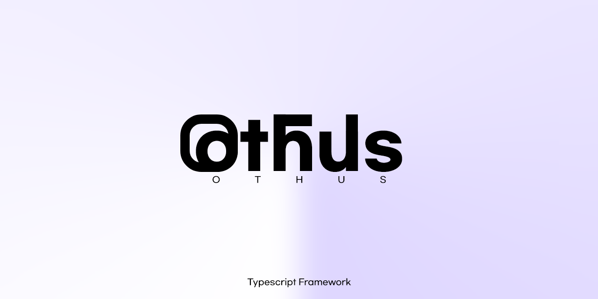

# 💫 othus
🆕 typescript-based framework

***Links: [npm](), [github]()***

### 💬 Differences from express
- Create an **xml grammar** from within the **typescript** file.
- More detailed information than ever before.
- Stronger ***routing*** than traditional *routers*.

### 📌 Installation
Run from the shell of the operating system:
```
$ npm install othus
```

### 📂 Recommended Directory Structure
...


### 💾 Example

```ts
import othus from 'othus';

const cors = () => {};

export const App: othus.ITF = {
    middleware: [cors()],
    body: (req: object, res: othus.ITF_body_res) => {
        const elements: any = othus.compile([
            { type: `p`, textContent: `lorem ipsum`, className: `asdf` },
            { type: `p`, textContent: `lorem ipsum`, className: `as2345df` },
            { type: `p`, textContent: `lorem ipsum`, className: `샌즈` },
            { type: `div`, child: { type: `span`, textContent: `test`, className: `test` } }
        ]);

        res.send(elements);
    }
}
```